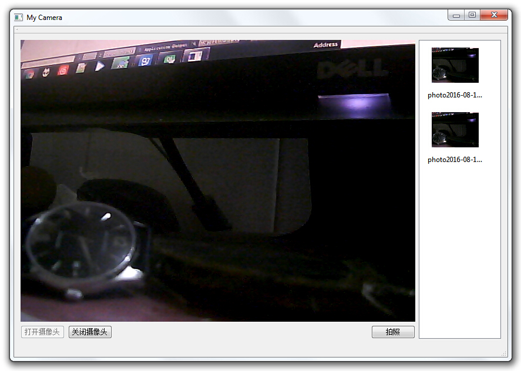

# MyCamera
Qt5: USB Camera using OpenCV
 
<li>1.使用Qt5开发程序界面。</li>
<li>2.依赖OpenCV打开USB摄像头。</li>
<li>3.使用Qt5的线程(QThread)实现实时传送OpenVC抓取的图像到UI。</li>
<li>4.简易的拍照保存为jpg格式并存储在程序所在路径的photos目录下。</li>
 
效果： 

